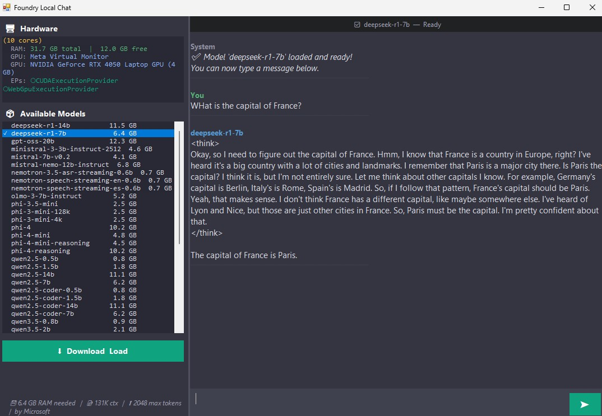

# Foundry Local ChatGPT-like App

This repository contains a ChatGPT-like application generated with **GitHub Copilot CLI**, using **Foundry Local (Orion) Edge AI SDK**.

The app was created as an experiment in building a local AI chat experience with .NET and Foundry Local, without relying on cloud-hosted inference.

## Context

This project was created during the **Build //localhost: Łódź** event organized by the Global AI Community.

Event page:
https://globalai.community/e/8t5jhoxh

The technical inspiration and architecture are based on Foundry Local, Orion, and the Edge AI SDK described here:
https://rzetelnekursy.pl/foundry-local-orion-edge-ai-sdk/

## Repository Structure

```text
Solution01/   — .NET 9 WinForms app (self-contained, win-x64)
Solution02/   — .NET Framework 4.8 WinForms chat app (win-x64)
Solution03/   — .NET Framework 4.8 WinForms Voice-to-Text app (win-x64)
```

### Solution01

`Solution01` was generated during preparation before the event.

It represents the initial version of the application and was used as a baseline for experimentation with Foundry Local, Orion, and the Edge AI SDK.

> ℹ️ After launch, fetching the model catalog from Foundry Local takes a moment — please wait a few seconds for the list to populate.

### Solution02

`Solution02` was generated live during the **Build //localhost: Łódź** event using GitHub Copilot CLI in a ChatGPT-like workflow.

The application was developed iteratively using prompts entered during the session.



**Features:**
- Lists all available Foundry Local models, each GPU and CPU variant shown as a **separate entry** (GPU listed first)
- Shows hardware info panel: CPU, RAM, GPU name, available execution providers
- Download & load any model variant directly from the UI
- GPU is the preferred device — if a GPU variant is available it is listed first and pre-selected
- Real-time streaming chat responses
- Conversation history maintained across turns

### Solution03

`Solution03` is a Voice-to-Text application generated using GitHub Copilot CLI.

**Engines supported:**
- **Windows Speech Recognition** (built-in, near-realtime): shows hypothesis words in gray as you speak, confirms them in white when recognised — no model download required
- **Foundry Local Whisper models**: record audio, then get a full transcription when you press Stop (buffer-and-transcribe mode — Whisper does not support live streaming)
- **Foundry Local Nemotron speech models**: live streaming transcription with real-time word-by-word results

**Key features:**
- Each model variant (GPU / CPU) is listed separately in the dropdown — GPU listed first
- Hardware info panel shows CPU, RAM, GPU name, and microphone count
- Microphone device selector — choose which input device to use
- "▶ Load into Memory" button appears for already-downloaded models so you can activate them without re-downloading
- Record button is only enabled once a model is loaded and ready
- Live scrolling transcript panel

> ℹ️ For Whisper models: press **Start Recording**, speak, then press **Stop Recording** — the transcription appears after you stop. For Nemotron models transcription appears in real time while you speak.

## Prompt History

### Prompts used to generate `Solution02` during the event

| #  | Time  | Prompt                                                                                              |
| -- | ----- | --------------------------------------------------------------------------------------------------- |
| 1  | 11:35 | yolo                                                                                                |
| 2  | 11:39 | autopilot                                                                                           |
| 3  | 12:43 | Create a .NET 4.x Foundry Local ChatGPT-like app, show available models, download & use — no winget |
| 4  | 13:00 | Use SDK without installing anything (like the architecture doc)                                     |
| 5  | 13:03 | run application                                                                                     |
| 6  | 13:08 | I see error foundry library core                                                                    |
| 7  | 13:10 | seems it is still not working...                                                                    |
| 8  | 13:25 | Display hardware info + how much memory the model will use                                          |
| 9  | 13:36 | run application                                                                                     |
| 10 | 13:41 | I see error: "Error from chat_completions command: Operation was cancelled"                         |

In total, `Solution02` was created through **10 prompts** over approximately **1 hour of work**.

### Prompts used to generate the GitHub Actions CI/CD

The GitHub Actions workflow (`.github/workflows/release.yml`) was also generated entirely using GitHub Copilot CLI, with the following prompts:

| #  | Prompt                                                                                                                                                                         |
| -- | ------------------------------------------------------------------------------------------------------------------------------------------------------------------------------ |
| 1  | Here I have 2 version of .NET application. These applications use Foundry Local. Using github action please compile these two applications and put them as releases -Solution00 and Solution01 in zip than user will be able to download the application zip file and run. If any application need any dependencies like Visual Studio Redistribuate package please modify the application to display these information with the link to download. |
| 2  | I need to compile the on every commit. Not manual                                                                                                                              |
| 3  | Add to README.MD the picture of Solution01 Solution01.jpg. Also Add the prompts that create Github Actions. Also add information that Solution00 needs to be fixed just seems initialising SDK doesnt work. |

### Post-event fixes applied via GitHub Copilot CLI

The following bugs and improvements were applied after the event using GitHub Copilot CLI:

| Fix | Solutions | Description |
| --- | --------- | ----------- |
| Missing `using` directive | Solution03 | Added `using Microsoft.AI.Foundry.Local.OpenAI` to resolve `LiveAudioTranscriptionSession` compilation error |
| Whisper streaming error | Solution03 | `LiveAudioTranscriptionSession` only works with Nemotron speech models. Whisper now buffers audio to a temp WAV file and calls `TranscribeAudioAsync()` on stop |
| GPU support | Solution02, Solution03 | GPU model variants listed separately (first) and loaded by default when available |
| Per-variant selection | Solution02, Solution03 | Each GPU/CPU variant shown as a separate list entry — user can explicitly choose the device |
| Load button bug | Solution03 | Downloaded-but-not-loaded models now show "▶ Load into Memory" (enabled); Record only activates after loading |
| Hardware GPU display | Solution03 | GPU name shown in hardware info panel via WMI |

## Downloads

Pre-built ZIP files are attached to every [GitHub Release](https://github.com/MariuszFerdyn/AIChat-FoundryLocalSDK/releases/latest).

| Release zip      | Description                                    | Requirements                                  |
| ---------------- | ---------------------------------------------- | --------------------------------------------- |
| `Solution01.zip` | .NET 9 WinForms chat app, self-contained win-x64 | Windows 10 1903+, [VC++ 2022 x64](https://aka.ms/vs/17/release/vc_redist.x64.exe) |
| `Solution02.zip` | .NET Framework 4.8 WinForms chat app, win-x64  | Windows 10 1803+, [VC++ 2022 x64](https://aka.ms/vs/17/release/vc_redist.x64.exe) |
| `Solution03.zip` | .NET Framework 4.8 WinForms Voice-to-Text, win-x64 | Windows 10 1803+, [VC++ 2022 x64](https://aka.ms/vs/17/release/vc_redist.x64.exe) |

### How to run after downloading

1. Go to the [latest release page](https://github.com/MariuszFerdyn/AIChat-FoundryLocalSDK/releases/latest) and download the ZIP you want.
2. Right-click the ZIP → **Extract All…** and unzip to any folder.
3. **Unblock the executable before running:**
   - Right-click the `.exe` file → **Properties**
   - At the bottom of the General tab, check **Unblock** → click **OK**
   - *(This step removes the "Mark of the Web" that Windows places on downloaded files.)*
4. Double-click the `.exe` to launch the app.
5. If Windows SmartScreen still appears, click **More info** → **Run anyway**.
6. On first launch, Foundry Local initialises and fetches the model catalog — **this takes a few seconds**, please wait for the list to populate before clicking anything.
7. Select a model variant (GPU variants are listed first), click **Download & Load**, and start chatting / recording.

## License
by AI... so feel free to use.

No license has been specified yet.
